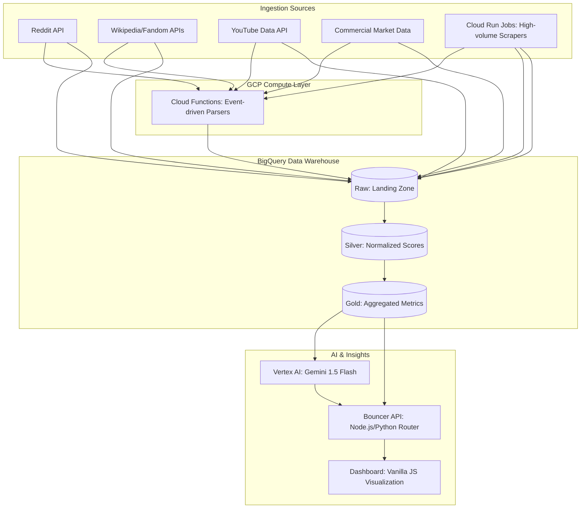

# ARCANE ANALYTICS: MASTER SPECIFICATION
**Consolidated Source of Truth**  
**Date:** 2026-03-11  

---

## 1. Project Architecture
*(Source: PROJECT_ARCH.md)*

# D&D Trends Index - Project Architecture

### 1.1 Environment & Infrastructure
*   **IDE:** Antigravity (VS Code) running in **Turbo Mode**.
*   **Container:** Docker DevContainer (Python 3.11).
    *   **OS:** Debian Trixie (Slim).
    *   **Tools:** `gcloud` CLI, `bq` (BigQuery) CLI, Python, Git.
*   **Security:** 
    *   **Service Account:** Authenticated via `dnd-key.json` (Scoped to `dnd-trends-index`).
    *   **Git:** Code is version controlled.
    *   **Data:** Backups via `utils/backup_bigquery.py`.

### 1.2 Cloud Resources (GCP)
*   **Project ID:** `dnd-trends-index`
*   **Data Warehouse:** BigQuery
    *   **Datasets:** `commercial_data`, `gold_data`, `silver_data`, `dnd_trends_raw`, `dnd_trends_categorized`, `social_data`, `itchio_data` (logical grouping in `dnd_trends_raw`).
    *   **Note:** `gold_data` and `silver_data` contain Views (Virtual Tables) which cannot be exported directly to CSV.

### 1.3 Key Scripts
| Script | Location | Purpose |
| :--- | :--- | :--- |
| **Backup Script** | `utils/backup_bigquery.py` | Exports all real tables to Cloud Storage (JSON format). Ignores Views. |
| **Dev Config** | `.devcontainer/devcontainer.json` | Defines the Docker build, installs `gcloud`, and auto-authenticates on launch. |

### 1.4 Operational Protocols (Turbo Mode)
*   **Before Destructive Actions:** Always run `python3 utils/backup_bigquery.py`.
*   **Credential Path:** In the container, use `/app/dnd-key.json` (mapped from host).
*   **Permissions:** If report generation fails with `Permission denied`, run `chmod 666` as root.
*   **Data Safety:** BigQuery "Time Travel" allows restoring tables deleted within 7 days.
*   **Repo Safety:** `.gitignore` must always include `dnd-key.json` and `.env`.

### 1.5 Current Workflow
1.  Launch Antigravity -> "Reopen in Container".
2.  Verify Hostname (ensure it's not `LAPTOP-XXX`).
3.  Agent has "Always Proceed" permission for coding and terminal commands.

### 1.6 Taxonomy Definitions: Hot Concepts
*   **Purpose:** To track high-volume D&D search terms that do not fit strictly within standard game categories (Class, Monster, etc.).
*   **Witch (Hot Concepts):** Uses the `Witch Dnd` variation to capture broader community interest in the archetype, separate from specific homebrew class builds.
*   **Active Search:** We periodically scan for and add trending concepts outside the core taxonomy to this category to maintain a baseline for cultural relevance.

### 1.7 Leading Indicator Logic: Itch.io
*   **Purpose:** To track upstream creator intent via Itch.io jams and indie products.
*   **Rationale:** Itch.io trends precede mainstream (DMs Guild/Google) trends by 12–18 months.
*   **Metrics:** Jam submission counts, vibe-based clustering, and pricing shifts.

---

## 2. AI-Ready Technical Specification
*(Source: ai_studio_tech_spec.md)*

# AI-Ready Technical Specification: Arcane Analytics

### 2.1 System Architecture
AI Studio and Gemini models can natively parse the flow described below:

### 2.2 Technical Stack Summary
- **Primary Language:** Python 3.10+
- **Infrastructure:** Google Cloud Platform (GCP)
- **Database:** Google BigQuery (Medallion Pattern)
- **AI Engine:** Vertex AI (model: `gemini-1.5-flash`)
- **API Architecture:** Gen 2 Cloud Functions (REST)
- **Frontend:** HTML5, Vanilla CSS, ApexCharts for data visualization.

### 2.3 Core Data Flow & Logic
1.  **Harvester Phase**: Independent Python scripts (deployed as Cloud Run Jobs) pull metrics from Reddit, YouTube, and Wiki sources.
2.  **Normalization (Silver)**: SQL views in BigQuery calculate the `PERCENT_RANK()` of raw metrics (0.0 to 1.0) relative to all other tracked keywords on the same day.
3.  **Trend Scoring (Gold)**: A composite "Trend Score" is calculated using weighted averages of the normalized scores (Hype + Play + Buy).
4.  **Narrative Generation**: The Daily Journalist engine feeds the top and bottom anomalies into Gemini 1.5 Flash to generate persona-driven news reports.
5.  **Leading Indicator Analysis**: Itch.io data is used to populate the "Market Whitespace" view, identifying trends 12-18 months ahead of mainstream demand.
6.  **Delivery**: The dashboard fetches JSON from the Bouncer API and renders a premium "glassmorphic" interface.

### 2.4 Architectural Redundancy (Text-Based)
*For non-Mermaid aware parsers:*
The system is a linear pipeline starting with API calls to social/commercial platforms. Data lands in BigQuery Raw tables, is cleaned in Silver views, and aggregated in Gold tables. Vertex AI generates text from the Gold layer, and both data and text are served via a unified API to a web-based dashboard.

---

## 3. Data Science Strategy
*(Source: data_science_strategy.md)*

# D&D Trend Intelligence: Data Science Strategy

### 3.1 The "Billboard" Charts (Dynamic Leaderboards)
We will adapt the list size based on the "Depth" of the category (using >200 items as the threshold).
*   **Technique**: `GROUP BY category, keyword`.
    *   **Large Categories (Monsters, Spells)**: **Top 40** (Billboard 40).
    *   **Niche Categories (Locations, Feats)**: **Top 20**.
*   **Value**: Ensures we don't list "bottom of the barrel" items for small categories while showing the full breadth of large ones.

### 3.2 Volatility & Hype Cycles (Exploratory)
Before defining "Momentum", we must understand the *shape* of the data.
*   **Volatility Profile**: Calculate Standard Deviation of interest over time.
    *   **Stable**: High Volume, Low Volatility (e.g., "Dragon"). *Evergreen Content*.
    *   **Spike**: Low Volume, High Volatility (e.g., "Vecna" during a release). *News Content*.
*   **Long-Term Trends**: Compare Monthly and Quarterly averages to find slow-burn risers vs. flash-in-the-pan fads.

### 3.3 The "Blue Ocean" Opportunity Matrix
This connects Search Volume (Demand) with Content Saturation (Supply - approximated by Wiki/Fandom presence or just "Knowledge Base" presence).
*   **Quadrants**:
    *   **High Demand / Low Saturation**: **"The Blue Ocean"**. (e.g., specific obscure 2e monsters trending due to Stranger Things). **Action**: Make multiple videos/articles.
    *   **High Demand / High Saturation**: **"The Red Ocean"**. (e.g., Tarrasque, Beholder). **Action**: High quality required to compete.
    *   **Low Demand / High Saturation**: **"Legacy/Archives"**.
    *   **Low Demand / Low Saturation**: **"The Void"**.

### 3.4 The "Long Leading" Indicator (Upstream Intent)
By incorporating Itch.io Jam data, we add a temporal dimension to the Blue Ocean matrix.
*   **Signal**: High Jam activity on a tag (e.g., "Liminal Dread") with low DMs Guild supply suggests a 12-month advance whitespace opportunity.
*   **Formula**: `Whitespace Score = (Jam Interest * 0.4) + (Google Momentum * 0.4) - (Established Supply * 0.2)`.

### 3.5 The "DM's Pulse" (Weekly Seasonality)
We will aggregate interest scores by `DayOfWeek` (0-6).
*   **Hypothesis**:
    *   **Utility Terms** (Conditions, Spells) peak on **Game Nights** (Fri/Sat/Sun).
    *   **Inspiration Terms** (Lore, Locations, Builds) peak on **Prep Days** (Tue/Wed).
*   **Value**: Tailor release schedules. "Release Build Guides on Tuesday", "Release Rules Explainers on Friday".

### 3.6 Share of Voice (Category Dominance)
A normalized comparison of total interest volume per category.
*   **Technique**: Sum of all `interest` scores in `Monster` vs. `Spell`.
*   **Value**: Understanding the macro-trends. Are people shifting from "Mechanics" (Player focus) to "Lore" (DM/Fan focus)?

---

## 4. Database Schema Documentation
*(Source: database_schema.md)*

# Database Schema Documentation: Arcane Analytics

### 4.1 Landing / Raw Layers
These datasets contain immutable, source-specific data.

#### Dataset: `dnd_trends_categorized`
Primary repository for community and trend data.

##### Table: `reddit_daily_metrics`
| Column | Type | Mode | Description |
| :--- | :--- | :--- | :--- |
| `extraction_date` | DATE | REQUIRED | Date data was pulled. |
| `subreddit` | STRING | REQUIRED | Source subreddit (e.g., `dndnext`). |
| `keyword` | STRING | REQUIRED | The matched TTRPG keyword. |
| `category` | STRING | NULLABLE | Keyword category (e.g., `Subclass`, `Monster`). |
| `mention_count` | INTEGER | REQUIRED | Total occurrences in scanned posts. |
| `weighted_score` | FLOAT | REQUIRED | Sum of (post_score * sub_weight). |

##### Table: `trend_data_pilot` (Google Trends)
| Column | Type | Mode | Description |
| :--- | :--- | :--- | :--- |
| `keyword` | STRING | REQUIRED | Search term. |
| `date` | DATE | REQUIRED | Interest date. |
| `value` | INTEGER | REQUIRED | Relative search volume (0-100). |

##### Table: `concept_library` (Canonical Knowledge Base)
| Column | Type | Mode | Description |
| :--- | :--- | :--- | :--- |
| `concept_name` | STRING | REQUIRED | The base term/keyword (e.g. "Fireball"). |
| `category` | STRING | NULLABLE | Tactical/Narrative category. |
| `source_book` | STRING | NULLABLE | Original CSV filename or manual source. |

### Dataset: `dnd_trends_raw` (Itch.io Expansion)
Used for high-fidelity indie signal ingestion.

#### Table: `itchio_products`
| Column | Type | Description |
| :--- | :--- | :--- |
| `product_id` | STRING | Primary Key (URL slug). |
| `title` | STRING | Product name. |
| `creator` | STRING | Author/Studio. |
| `tags` | STRING (REPEATED) | Raw community tags. |
| `aesthetic_clusters` | STRING (REPEATED) | AI-mapped vibe clusters. |
| `list_type` | STRING | Source list (top_sellers, new_popular). |

#### Table: `itchio_jams`
| Column | Type | Description |
| :--- | :--- | :--- |
| `jam_id` | STRING | Unique Jam identifier. |
| `jam_title` | STRING | Name of the game jam. |
| `submission_count` | INTEGER | Vitality metric (leading indicator). |
| `theme_keywords` | STRING (REPEATED) | Mapped aesthetic keywords. |

#### Dataset: `social_data`
##### Table: `youtube_videos`
| Column | Type | Mode | Description |
| :--- | :--- | :--- | :--- |
| `video_id` | STRING | REQUIRED | YouTube Video ID. |
| `title` | STRING | REQUIRED | Video title. |
| `published_at` | TIMESTAMP | REQUIRED | Upload date. |
| `velocity_24h` | FLOAT | REQUIRED | Normalized view count in first 24h. |
| `matched_keywords` | STRING | REPEATED | Array of keywords found in metadata. |

### 4.2 Silver Layer (`silver_data`)
Standardized normalization views.

#### View: `norm_wikipedia` | `norm_fandom` | `norm_youtube`
| Column | Type | Description |
| :--- | :--- | :--- |
| `date` | DATE | Snapshot date. |
| `keyword` | STRING | Standardized entity name. |
| `score_[source]` | FLOAT | **Percentile Rank (0.0 to 1.0)** of the raw metric. |

### 4.3 Gold Layer (`gold_data`)
Business-level insights and the final Trend Score.

#### View: `trend_scores`
| Column | Type | Description |
| :--- | :--- | :--- |
| `date` | DATE | Tracking date. |
| `keyword` | STRING | The entity being tracked. |
| `norm_wiki` | FLOAT | Normalized Wikipedia score. |
| `norm_fandom` | FLOAT | Normalized Fandom score. |
| `norm_youtube` | FLOAT | Normalized YouTube velocity score. |
| `norm_roll20` | FLOAT | Normalized Roll20 ranking score. |
| `hype_score` | FLOAT | Composite: `avg(wiki, fandom, youtube)`. |
| `play_score` | FLOAT | Composite. |
| `trend_score_raw` | FLOAT | Final Weighted Score (0-100 scale). |

#### Table: `daily_articles`
| Column | Type | Description |
| :--- | :--- | :--- |
| `date` | DATE | Article publication date. |
| `headline` | STRING | Generated headline. |
| `hook` | STRING | Lead-in summary sentence. |
| `body_markdown` | STRING | Full article content (Markdown). |
| `persona` | STRING | Author voice (Tavern Keeper, Sage, Goblin). |

### 4.4 Metadata Layer
#### Table: `expanded_search_terms` (Operational Search Registry)
| Column | Type | Description |
| :--- | :--- | :--- |
| `term_id` | STRING | Unique UUID for the expanded query. |
| `original_keyword` | STRING | **Relation**: Links back to `concept_library.concept_name`. |
| `category` | STRING | **Relation**: Links back to `concept_library.category`. |
| `search_term` | STRING | The actual string sent to Google Trends. |
| `is_pilot` | BOOL | Flag for pilot dataset inclusion. |

### 4.5 Architectural Note: Keyword Expansion
A discrepancy often exists between the number of **Concepts** (~11k) and **Search Terms** (~18k-21k). 
- **Concepts** (`concept_library`): Canonical D&D entities (e.g., "Fireball").
- **Search Terms** (`expanded_search_terms`): Variants generated by the **Expansion Engine** (e.g., "Fireball 5e", "Fireball TTRPG") to maximize Google Trends data quality.
- **Pilot Data** (`trend_data_pilot`): The subset of expanded terms that have active historical data.
