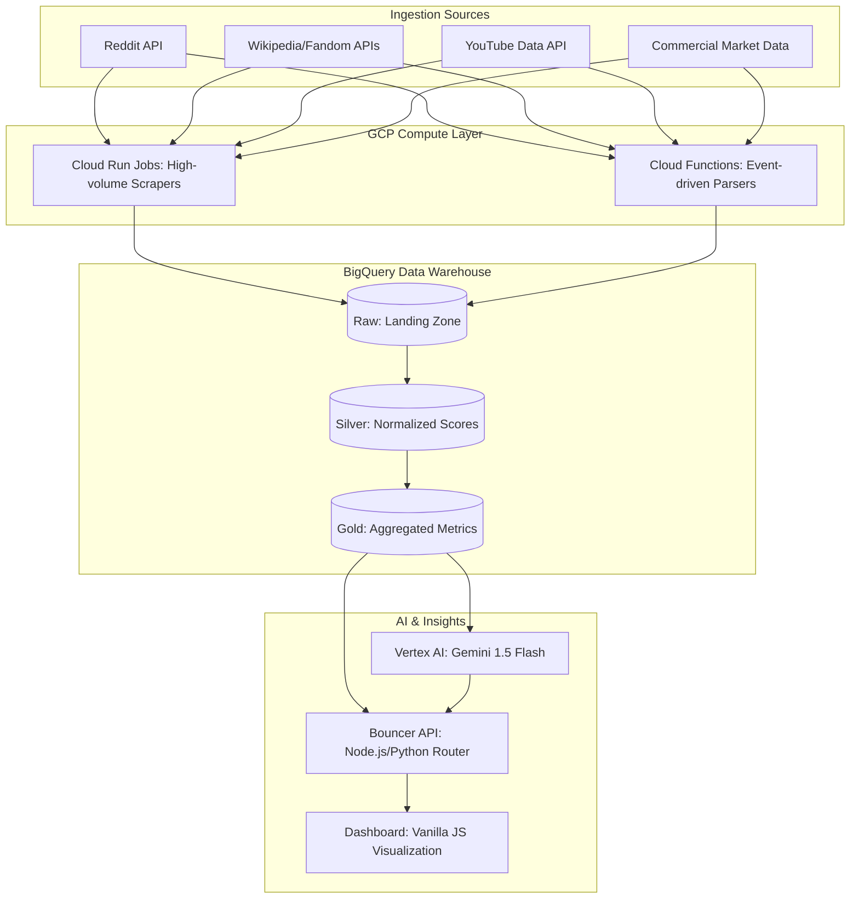

# AI-Ready Technical Specification: Arcane Analytics
**Project Name:** Arcane Analytics (dnd-trends-tracker)  
**Date:** 2025-12-31  

---

## 1. System Architecture (Mermaid)
AI Studio and Gemini models can natively parse the flow described below:

---

## 2. Technical Stack Summary
- **Primary Language:** Python 3.10+
- **Infrastructure:** Google Cloud Platform (GCP)
- **Database:** Google BigQuery (Medallion Pattern)
- **AI Engine:** Vertex AI (model: `gemini-1.5-flash`)
- **API Architecture:** Gen 2 Cloud Functions (REST)
- **Frontend:** HTML5, Vanilla CSS, ApexCharts for data visualization.

---

## 3. Core Data Flow & Logic
1.  **Harvester Phase**: Independent Python scripts (deployed as Cloud Run Jobs) pull metrics from Reddit, YouTube, and Wiki sources.
2.  **Normalization (Silver)**: SQL views in BigQuery calculate the `PERCENT_RANK()` of raw metrics (0.0 to 1.0) relative to all other tracked keywords on the same day.
3.  **Trend Scoring (Gold)**: A composite "Trend Score" is calculated using weighted averages of the normalized scores (Hype + Play + Buy).
4.  **Narrative Generation**: The Daily Journalist engine feeds the top and bottom anomalies into Gemini 1.5 Flash to generate persona-driven news reports.
5.  **Delivery**: The dashboard fetches JSON from the Bouncer API and renders a premium "glassmorphic" interface.

---

## 4. Architectural Redundancy (Text-Based)
*For non-Mermaid aware parsers:*
The system is a linear pipeline starting with API calls to social/commercial platforms. Data lands in BigQuery Raw tables, is cleaned in Silver views, and aggregated in Gold tables. Vertex AI generates text from the Gold layer, and both data and text are served via a unified API to a web-based dashboard.
